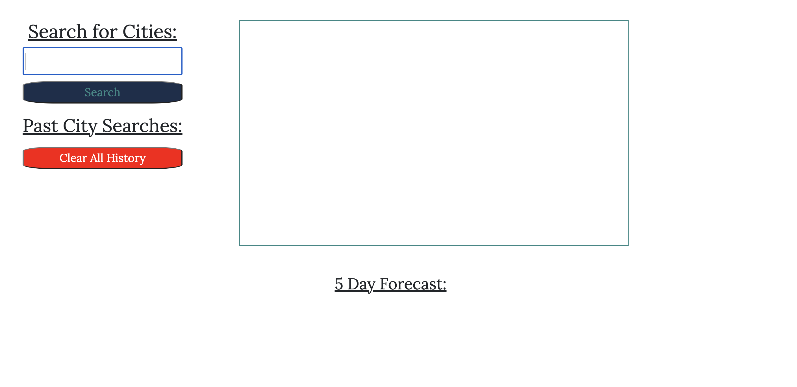
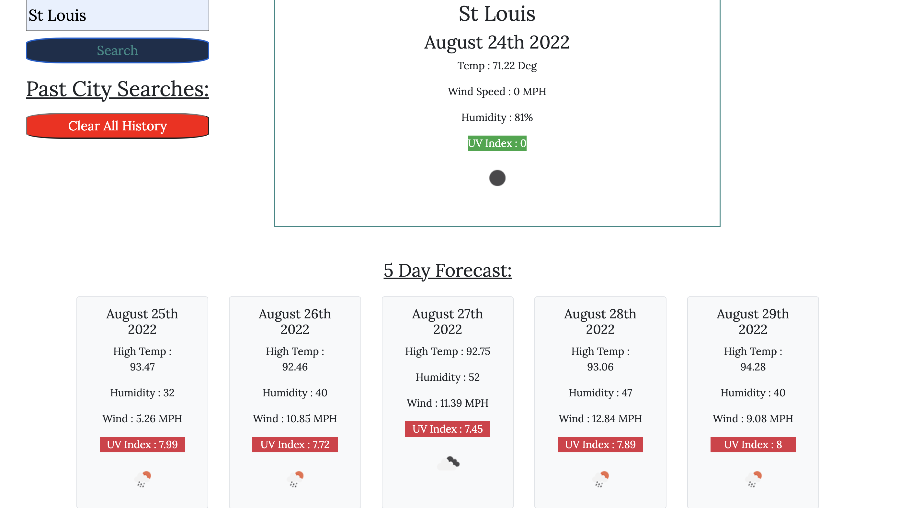

# Weather Dashboard
### Challenge 6

## Live Deployment Link

[Weather Dashboard](https://vincenttoon.github.io/five-day-weather/)

## Instructions for Challenge

Use Third-Party API's to create a functioning and interactive webpage that displays the current weather and a five day forecast. A culmination of all the skills we've used so far, with a primary focus on API documentation and execution of those parameters through JS.

## Current Bugs

- Cannot for the life of me figure out how to display my Storage data to the buttons I created and search their locations
- TA told me to turn in, reorganize code and API calls into multiple functions
- Will return to adjust for full functionality later

## Deployment Team

[Vincent Toon](https://github.com/Vincenttoon)

## User Story
AS A traveler
I WANT to see the weather outlook for multiple cities
SO THAT I can plan a trip accordingly

### Acceptance Criteria
- GIVEN a weather dashboard with form inputs
- WHEN I search for a city
- THEN I am presented with current and future conditions for that city and that city is added to the search history
- WHEN I view current weather conditions for that city
- THEN I am presented with the city name, the date, an icon representation of weather conditions, the temperature, the humidity, the wind speed, and the UV index
- WHEN I view the UV index
- THEN I am presented with a color that indicates whether the conditions are favorable, moderate, or severe
- WHEN I view future weather conditions for that city
THEN I am presented with a 5-day forecast that displays the date, an icon representation of weather conditions, the temperature, the wind speed, and the humidity
- WHEN I click on a city in the search history
- THEN I am again presented with current and future conditions for that city